# Design Document: Data-Driven Development for a Universal `KeyMapper`

## 1. Introduction and Goal

The `loralib v2` framework aims to be a universal tool for analyzing and manipulating model deltas. The cornerstone of this universality is the `KeyMapper` service, which must translate a chaotic landscape of tensor naming schemes into a single, canonical internal format. The diversity of formats from official releases (SDXL, FLUX, Stable Cascade), community libraries (Diffusers), and countless training scripts (kohya-ss, LyCORIS) makes it impossible to achieve robust coverage through traditional, hand-written unit tests alone.

This document outlines the **data-driven development loop** we are employing to build and refine the `KeyMapper`. This methodology leverages a large, real-world dataset of models to systematically identify, diagnose, and fix gaps in our mapping logic. The goal is not just to write code, but to build a resilient, self-improving system where the test harness is as critical as the code it's testing.

## 2. The Core Engine: The `test_key_mapper.py` Harness

Our development loop is powered by a data-driven test harness. This harness is designed to simulate the real-world challenge of identifying and parsing thousands of disparate files.

### 2.1. The Dataset: `compressed_sft_index.json`

The foundation of our approach is a large index file containing the metadata and key schemas for thousands of `.safetensors` files. This dataset is intentionally "messy," containing a mix of:

- Full model checkpoints (SD 1.5, SDXL, etc.)
- Valid adapters (LoRA, LoCon, LoHa) with various naming conventions.
- Corrupted or "junk" files.
- Models for entirely different architectures (e.g., standonlone text encoder, SigLIP, Controlnets, etc...).

This messiness is a feature, not a bug. It forces us to build robust classification and error-handling logic from the outset.

### 2.2. The Reference: Base Models

The harness is executed against one or more reference base models (e.g., `sd_xl_base_1.0.safetensors`). This allows us to test the `KeyMapper`'s ability to generate the correct "Rosetta Stone" for a specific model architecture and then measure how well it maps adapters intended for that architecture.

### 2.3. The Subject: The `KeyMapper`

The `KeyMapper` and its pluggable `MappingGenerator` components are the system under test. The harness initializes a `KeyMapper` for each base model and uses it to perform the tests.

## 3. The Development Loop in Practice

Our workflow was an iterative process of running the harness, analyzing its output, fixing the most significant problems, and repeating until we achieved near-perfect mapping.

```mermaid
graph TD
    A[1. Run Test Harness] --> B{2. Analyze Report};
    B --> |Identify Failure Pattern| C(3. Fix/Enhance Generator);
    C --> A;

    style B fill:#121,stroke:#333,stroke-width:2px
    style C fill:#121,stroke:#333,stroke-width:2px
```

**Step 1: Execute (`python test_key_mapper.py ...`)**
The process began by running the test harness against the full data index and a target base model, which generated a report.

**Step 2: Analyze the Report**
The report output is our primary tool for diagnosis. We analyzed it from the top down:
- **File Classification & Testing Summary:** This told us how well we filtered signal from noise. Initially, this revealed that our simple heuristics were misclassifying thousands of adapters.
- **Per-Base Model Mapping Results:** This gave us our core success metric. We started with a high failure rate and iteratively drove it to **~100%**.
- **Top 10 Global Key Mapping Failures:** This provided a prioritized worklist. The initial reports clearly showed a systemic problem with SDXL Text Encoder 2 (`lora_te2_...`) keys.

**Step 3: Diagnose and Fix**
Using the report, we systematically addressed each problem:
- **Identified and Fixed TE2 Mapping:** The initial failures were traced to an incomplete mapping for the SDXL CLIP-G text encoder. Specifically, community LoRAs use separate `q_proj`, `k_proj`, `v_proj` keys, while the base model uses a combined `in_proj_weight`. The `ClipGMappingGenerator` was fixed to handle this many-to-one mapping.
- **Refined Classification Logic:** The crude `key_count > 500` heuristic for identifying base models was replaced with an intelligent `CheckpointAssessor` class that analyzes key structure, dramatically improving classification accuracy.
- **Addressed Performance Regressions:** The test harness was refactored to restore schema-based processing, ensuring high performance while maintaining a clean, single-pass design.

- **Identify the Pattern:** We see `lora_te2_text_model_encoder_layers_...`. This immediately points to an issue in how we handle the second SDXL text encoder.
- **Form a Hypothesis:** Looking at the `DiffusersMappingGenerator`, the logic for `CLIP-G` is marked with a `TODO` and is likely incomplete. It probably doesn't correctly handle the mapping for MLP (`fc1`, `fc2`) layers in TE2, only attention projections.
- **Modify a Generator:** We will enhance the `DiffusersMappingGenerator` or `ComfyUIPrefixGenerator` to correctly map these `fc1`/`fc2` keys for the `lora_te2` prefix. The fix is contained entirely within a single generator, minimizing the risk of side effects.

**Step 4: Repeat**
We re-run the harness. If the fix is correct, the "Top 10 Failures" list will change, the `lora_te2` keys will disappear from it, and the overall success percentage will increase. We then move to the next item on the failure list.

## 4. Overcoming Hurdles: Evolving the Harness

As we expand support to more architectures, new challenges will arise. We must evolve the test harness itself to provide ever-clearer insights.

## 4. An Evolved and Capable Test Harness

The initial test harness was functional but has since been significantly upgraded to provide deeper insights and support a more robust, modular architecture.

### From Challenge to Capability: Actionable Failure Analysis

The initial challenge was turning a raw list of failing keys into actionable intelligence. This was solved by implementing:
1.  **Automated Failure Pattern Grouping:** The report now automatically groups failures by common prefixes, which immediately isolated the TE2 issue as the top priority.
2.  **Verbose Debug Mode:** A `--debug-key` flag was added to the harness to trace the mapping attempt for a single key, which was instrumental in uncovering subtle bugs like a typo in a key name (`in_proj.weight` vs. `in_proj_weight`).
3.  **Rejection Logging:** The harness now reports samples of files that were rejected for being "ambiguous" or having a low-but-non-zero compatibility score. This has correctly identified non-standard models (T5, SigLIP) and potential SD3-era LoRAs that require future attention.

### From Challenge to Capability: Extensibility for New Architectures

- **Problem:** The current `KeyMapper` and its generators are SD-centric. Adding logic for a completely new model like FLUX directly into the existing generators would create a tangled, unmaintainable mess.
- **Solution: A Modular Identification Service:** The `KeyMapper`'s ad-hoc detection logic has been formalized into a `ModelIdentifier` service. This service is designed for extensibility and is used directly by the test harness.
  1.  **Data-Driven Detection:** To add a new architecture like `Stable Cascade`, we simply define a new `StableCascadeSignature` data object. This signature contains not only "sentinel" keys to identify the family, but also a list of `ComponentSignature` objects (e.g., for its specific UNet or text encoders), each with its own set of root key prefixes. This makes component detection robust and reusable.
  2.  **Pluggable Canonicalization:** If the new architecture requires key cleanup (like SDXL's `in_proj_weight`), a small, self-contained `StableCascadeCanonicalizer` class is created.
  3.  **Automated Test Harness Discovery:** The test harness now uses the `ModelIdentifier` to scan *every schema* in the `compressed_sft_index`. It automatically discovers all potential base models and their specific components (SDXL with UNet+CLIP-L+CLIP-G, SD 1.5 with UNet+CLIP-L, etc.). It then instantiates a `KeyMapper` for each discovered base model and tests all compatible adapters against it, dramatically increasing test coverage and rigor.

The initial design risked becoming an unmaintainable monolith. This was solved by a significant refactoring effort:
1.  **Modular, Specialized Generators:** All text-encoder-specific logic was moved out of generic generators and into dedicated classes (`ClipLMappingGenerator`, `ClipGMappingGenerator`). This makes the system cleaner, easier to maintain, and proves its readiness for future expansion.
2.  **Portable Classification Logic:** The `CheckpointAssessor` was designed as a self-contained component that does not depend on the test harness's indexing, making it easy to move into the core `loralib` library for use in the main application.

## 5. Conclusion

This data-driven development loop has been a resounding success. It transformed an intractable problem—supporting a chaotic ecosystem of models—into a manageable, iterative engineering process. By prioritizing fixes based on real-world data, we focused our efforts where they would have the most impact. The test harness has proven to be an indispensable tool, enabling us to build a `KeyMapper` that is not only and **~100% accurate** on our test set, but also robust, maintainable, and ready for the future of model architectures.
