# Design Document: `loralib` v2 - A Unified Framework for Model Delta Analysis and Manipulation

## 1. Introduction

The current `loralib` and its associated `resize_lora.py` tool have proven effective for their initial purpose: resizing SDXL LoRA models using context-aware scoring methods. However, the landscape of model customization is fragmented, with a multitude of checkpoint formats, adapter types, and naming conventions. The existing library is not equipped to handle this diversity, nor can it operate on implicit model differences derived from full fine-tunes (SFTs).

This document outlines a significant overhaul of `loralib` to transform it into a universal framework for analyzing and manipulating "model deltas." A model delta is defined as any set of targeted changes to a base model, whether it comes from an explicit adapter file (like a LoRA) or is implicitly calculated as the difference between a fine-tuned checkpoint and its base.

The primary goal of this redesign is to abstract away the complexities of naming schemes and formats. The new library will operate on a single, canonical internal representation, allowing the powerful scoring and factorization algorithms to be applied universally. This will enable `loralib` to not only resize any LoRA-like adapter but also to factorize full-rank checkpoint differences into new, highly compressed LoRA models, all while leveraging the same sophisticated, context-aware metrics.

## 2. Code Overview & Notable Existing Algorithms

The provided corpus contains several key architectural patterns and algorithms that will serve as the foundation for the new design.

### 2.1 The ComfyUI Key-Mapping Strategy ("Rosetta Stone")

The most critical pattern is ComfyUI's dynamic, load-time key mapping system, primarily found in `comfy/lora.py` and `comfy/sd.py`. This system is the reason for ComfyUI's exceptional compatibility.

- **Canonical Internal Format:** ComfyUI treats the original LDM/A1111 checkpoint format (e.g., `model.diffusion_model.input_blocks.1.1.proj_in.weight`) as its internal "ground truth".
- **Dynamic Mapping:** The `model_lora_keys_unet` and `model_lora_keys_clip` functions build a mapping dictionary (`key_map`) at runtime. This dictionary's keys are the various "foreign" LoRA key names found in the wild (e.g., `lora_unet_...`, `down_blocks.0...`, `lycoris_...`), and its values are the corresponding canonical ComfyUI key.
- **Result:** This many-to-one mapping allows the core application logic to operate on a single, consistent set of keys, regardless of the source file's format. This "Rosetta Stone" approach is the central principle we will adopt for universal input handling.

### 2.2 The ComfyUI Weight Adapter Abstraction

The `comfy/weight_adapter/` directory demonstrates a clean, object-oriented approach to handling different adapter types.

- **`WeightAdapterBase`:** Defines a common interface for all adapters. The `load` classmethod is responsible for detecting if a set of tensors in the LoRA file corresponds to this adapter type, and the `calculate_weight` method contains the type-specific mathematics.
- **Modular Implementations:** Each adapter (LoRA, LoHa, LoKr, etc.) has its own file and class inheriting from `WeightAdapterBase`.
- **Benefit:** This pattern allows for easy extensibility. Adding support for a new adapter format is as simple as creating a new class that implements the required interface. We will use this to differentiate between factorizable deltas (LoRA, DoRA, Full-Diff) and non-factorizable ones (LoHa, LoKr) that should be passed through.

### 2.3 `loralib`'s Efficient SVD and Scoring

The existing `loralib` and `resize_lora.py` have a robust and efficient core for their specific task. These components will be preserved and generalized.

- **`fast_decompose`:** This function in `loralib/num_utils.py` avoids materializing the full `B @ A` matrix for SVD by using QR decompositions on the smaller `A` and `B` matrices. This is a critical performance optimization that will be retained.
- **Recipe-Based Scoring:** The `ResizeRecipe` class provides a powerful and flexible way to define dimension importance using a weighted combination of metrics (`fro_ckpt`, `spn_lora`, `params`, etc.). After an overall, this system will be the core of the new library's analysis engine, applied to all factorizable delta types.
- **Base Model Statistics Caching:** The use of `JsonCache` to store computed norms of the base checkpoint (`norms_cache.json`) is an effective optimization that will also be retained.

## 3. Exhaustive Summary of New Design Requirements

The new library will be designed to meet the following functional and non-functional requirements.

### 3.1. Functional Requirements

1.  **Unified Input Handling:** The library must accept two primary input modes:

    - **Adapter Input:** A single adapter file (e.g., LoRA `.safetensors`).
    - **Checkpoint-Diff Input:** Two full checkpoint files (`base_model.safetensors` and `sft_model.safetensors`). The library will compute the weight differences internally.

2.  **Canonical Key Representation:** All input tensor keys, regardless of their source format, must be mapped to a single, canonical internal representation. We will adopt the **LDM/A1111 format** (e.g., `model.diffusion_model...`) as the internal standard, following ComfyUI's precedent.

3.  **Comprehensive Naming Scheme Support:** The key mapper must recognize and correctly map keys from at least the following schemes:

    - **UNet Keys:**
      - LDM / A1111 (`model.diffusion_model...`)
      - Diffusers (`down_blocks.0.attentions...`)
      - Various trainer-specific prefixes (`lora_unet_`, `lycoris_unet_`, etc.)
    - **Text Encoder Keys:**
      - SD 1.5 (`cond_stage_model.transformer...` -> `lora_te_...`)
      - SDXL TE1/TE2 (`conditioner.embedders.0/1...` -> `lora_te1_...`, `lora_te2_...`)
      - Diffusers TE (`text_encoder...`, `text_encoder_2...`)

4.  **Comprehensive Adapter Format Identification:** The system must be able to identify the _type_ of adapter or delta for each layer. This is crucial for deciding whether to factorize or pass-through.

    - **Factorizable Types:**
      - **Standard LoRA/LoCon:** (`lora_down.weight`, `lora_up.weight`, `lora_mid.weight`)
      - **DoRA:** LoRA weights plus a `dora_scale` tensor.
      - **Full-Rank Difference:** An implicit delta calculated from two checkpoints.
    - **Pass-Through Types (Non-Factorizable by this tool):**
      - **LoHa:** (`hada_w1_a`, etc.)
      - **LoKr:** (`lokr_w1`, etc.)
      - **IA³:** (`ia3_input_mask.weight`)
      - _Others detected by ComfyUI's system should be gracefully handled._

5.  **Revanped Recipe system and configuration**: We will extend the ResizeRecipe to re-normalize the current field and support new functionalities. The current recipe string format is already complex and adding new features is damning for the user. We need a configuration file format, were user can store and name their own presets. Will use toml for the user facing editable file and json for the serialization in the output metadata.

6.  **Context-Aware Scoring Generalization:** The scoring recipes (`fro_ckpt`, `spn_lora`, etc.) must apply to all factorizable types.

    - When using **Checkpoint-Diff Input**, the `base_model` will serve as the reference for `*_ckpt` metrics.
    - The term "LoRA" in scoring methods like `spn_lora` will be generalized to mean "the delta itself" (e.g., `spn_delta`).

7.  **Flexible Output:** The library must be able to reconstruct the processed delta into a standard LoRA safetensors file. When processing a non-LoRA adapter (e.g., LoHa), it should reconstruct it in its original format, only changing the rank/dimensions of the factorizable sub-components if applicable (though currently, all such types are pass-through). We will support only one format.

### 3.2. Non-Functional Requirements

1.  **Modularity and Extensibility:** The architecture must be modular, making it straightforward to add support for new naming schemes or adapter formats without rewriting core logic. This will be achieved by isolating key mapping and adapter-specific logic into dedicated components.
2.  **Performance:** The high performance of the existing `fast_decompose` SVD method and the base model norm caching must be maintained. Processing should remain memory-efficient. For weight difference on large checkpoints, weights must be loaded pair by pair, for minimizing memory usage. The new abstraction for weight difference **must not** store the complete checkpoints in memory at any point in time.
3.  **Clarity and Maintainability:** The codebase should be well-structured and documented, with a clear separation of concerns (e.g., data loading, key mapping, SVD, scoring, and reconstruction).

## Risk Identification and Non-Backtrackable Decisions

This section outlines the primary risks and foundational architectural choices. Addressing these upfront is critical to avoid costly refactoring and ensure the project's success.

### 1. Risks Specific to the Domain and Current Codebase

- **Risk of Unmanageable Complexity:** The primary risk is the sheer, ever-growing diversity of naming schemes and adapter formats. The existing ComfyUI code, while functional, handles this with a large, monolithic block of conditional logic (`comfy/lora.py`). Directly replicating this pattern will lead to a brittle and unmaintainable library.

  - **Mitigation:** We must adopt a pluggable, modular architecture for key mapping and adapter parsing, avoiding hardcoded, monolithic functions.

- **Risk of Rapid Obsolescence:** New adapter formats (like OFT, BOFT) appear frequently. A rigid system that only understands a fixed set of formats will quickly become outdated.

  - **Mitigation:** The design must gracefully handle unknown adapter types by categorizing them as "pass-through" by default. The core logic should not fail if it encounters an unrecognized tensor format; it should simply carry it over to the output unmodified.

- **Risk of Propagating Flawed Logic:** The provided `wd_to_lora.py` script contains hardcoded key conversions (e.g., `f"diffusion_model.{lora_key_base}"`). This logic is incorrect as it confuses base model key formats with LoRA key formats, producing an invalid LoRA file.
  - **Mitigation:** This script will be entirely superseded. The new key mapping system must be robust and based on the successful patterns observed in ComfyUI, not this flawed attempt.

### 2. Representation and Algorithm Difficulties

The most significant architectural deficiency in the current `loralib` is its data representation. This is the primary friction point and must be addressed first.

- **Insufficient Data Representation:** The `PairedLoraModel` and `LoRADict` classes are fundamentally insufficient for the new goals.

  - They are hard-coded to the `lora_up`/`lora_down`/`alpha` structure, making them incapable of representing a full-rank weight difference from a checkpoint diff.
  - They assume the "delta" already exists in a file and is pre-decomposed. They cannot represent a delta that needs to be computed on the fly.

- **Decision: Replace `PairedLoraModel` and `LoRADict` (Non-Backtrackable):** These classes will be deprecated and replaced with a new, more abstract system. This is a foundational, non-backtrackable decision. The proposed replacement consists of two core abstractions:

  1.  **`DeltaSource`:** An abstract interface representing the origin of the model delta. Concrete implementations will be `AdapterFileSource` (for LoRAs, etc.) and `CheckpointDiffSource` (for two full models). This class is responsible for iterating through layers and providing their raw delta data.
  2.  **`CanonicalDelta`:** A data structure representing the delta for a single layer _after_ it has been parsed and mapped to its canonical key. It must be flexible enough to hold either a full-rank tensor (from a diff) or pre-decomposed matrices (from a LoRA). This object will be the standard input for all factorization and scoring algorithms.

- **Algorithms:** The core `fast_decompose` (SVD) and `ResizeRecipe` (scoring) algorithms are sound and will be preserved. The refactoring effort will focus on adapting their _inputs and outputs_ to work with the new `CanonicalDelta` representation, rather than changing the algorithms themselves.

### 3. Out of Scope and Format Support

To manage scope and ensure a high-quality, maintainable output, we will adhere to the principle: _"Be liberal in what you accept, and conservative in what you produce."_

- **Input Flexibility and Pass-Through:**

  - The library will attempt to parse any adapter format recognized by ComfyUI's `weight_adapter` system (LoRA, DoRA, LoHa, LoKr, OFT, BOFT, IA³, etc.).
  - **Factorization will be limited** to deltas that are mathematically equivalent to matrix modification and fit the SVD model. This includes:
    - Standard LoRA / LoCon
    - DoRA (the LoRA part is factorized; `dora_scale` is passed through)
    - Full-Rank Differences (from checkpoint diffs)
  - All other recognized adapter types (LoHa, LoKr, etc.) will be treated as **atomic, non-factorizable pass-through units**. Their tensors will be preserved verbatim in the output file. This avoids the immense complexity of trying to resize fundamentally different mathematical constructs.

- **Output Standardization (Non-Backtrackable):**
  - The tool will **always** produce a single, standard output format for resized or factored LoRAs. This eliminates the need to maintain multiple output writers and simplifies downstream usage.
  - **Evaluation of Output Formats:**
    - _Diffusers-style (`down_blocks.0...`):_ Clean but relies on fallback logic in the loader to infer whether a key targets the UNet or a Text Encoder, creating potential ambiguity.
    - _ComfyUI-native (`lora_unet_...`, `lora*te1*...`):\_ Verbose but completely unambiguous. The prefix explicitly declares the target model component. This is the most robust format.
  - **Decision:** The output format will be the **ComfyUI native, prefix-based naming scheme**. This provides maximum compatibility and explicitness, ensuring the generated files are immediately and correctly usable by the widest range of tools that follow ComfyUI's loading logic.

### 4. Other Foreseen Risks & Decisions

- **Memory Management for Checkpoint Diffs:** Loading two full SDXL checkpoints (>6GB each) into memory is not viable.

  - **Decision:** The `CheckpointDiffSource` implementation _must_ operate in a streaming, key-by-key manner. It will iterate through the keys of the SFT model, loading only the corresponding tensor pair from the base and SFT models into memory for diffing and SVD, then immediately releasing them.

- **Metadata Handling:** Merging metadata from two checkpoints or a LoRA and a base model can be complex.

  - **Decision:** The library will primarily use the metadata from the "target" model (the SFT checkpoint or the input LoRA file). It will inject its own `loralib_v2` metadata, including the recipe and parameters used, overwriting any previous resizing info.

- **DoRA `dora_scale` Integrity:** The `dora_scale` tensor is calculated based on the original, full-rank weight and the original LoRA. After resizing the LoRA component, this scale is no longer mathematically "correct" for the new, smaller LoRA. Re-calculating it would require the original base and SFT weights, adding significant complexity.
  - **Decision:** For simplicity and predictability, the `dora_scale` tensor will be passed through **unmodified**. This is an acknowledged simplification. The practical impact is expected to be minimal, but it is a limitation of the initial scope.

## 1. Proposed Architecture

The new `loralib` architecture is designed for modularity, universality, and long-term maintainability. It achieves this by aggressively decoupling the concerns of data sourcing, key-name translation, and delta manipulation through a standardized, multi-stage processing pipeline. This design treats any set of model modifications—whether from a LoRA file or a checkpoint difference—as a "model delta" that can be processed through a common workflow.

### 1.1. Core Concepts and Abstractions

The system is built upon four primary abstractions that standardize the data and its context at each stage of processing.

1.  **`DeltaSource` (The "What"):** An abstract interface representing the origin of the model delta. It is responsible for providing a stream of raw layer data in a memory-efficient way.

    - **`AdapterFileSource`:** A concrete implementation for single adapter files (LoRA, DoRA, LoHa, etc.). It iterates through the tensors in the provided file.
    - **`CheckpointDiffSource`:** A concrete implementation for two full checkpoints (base and SFT). It iterates through the keys of the SFT model and, for each key, computes the weight difference `(W_sft - W_base)` on-the-fly, avoiding loading entire checkpoints into memory.

2.  **`KeyMapper` (The "Where"):** A stateless service acting as the universal translator or "Rosetta Stone" for all tensor naming schemes.

    - **Responsibility:** Its sole function is to take a raw tensor key from any `DeltaSource` (e.g., `down_blocks.0.attentions.0.proj_in.lora_down.weight`) and map it to a canonical LDM/A1111 key (e.g., `model.diffusion_model.input_blocks.1.1.proj_in.weight`).
    - **Implementation:** It will encapsulate and expand upon the complex, conditional logic from ComfyUI's `model_lora_keys_unet` and `model_lora_keys_clip`, creating a single, maintainable, and testable source of truth for all naming conventions.

3.  **`ReferenceModel` (The "Context"):** An abstraction for the base model, providing the necessary context for `*_ckpt` scoring metrics.

    - **Responsibility:** Provides efficient, cached access to the norms of the base model's layers.
    - **Implementation:** An evolution of the existing `BaseCheckpoint` class. It will manage a `norms_cache.json` file. When requested for a norm (e.g., `spectral_norm` or `frobenius_norm`) for a given **canonical key**, it will either return the cached value or compute it, store it, and then return it. This ensures that expensive SVDs on the base model are performed only once per layer, regardless of how many recipes or deltas are processed against it.

4.  **`CanonicalDelta` (The "Standardized Currency"):** This is the central data structure of the pipeline, representing the delta for a single layer in a standardized format. All downstream components operate exclusively on this object.
    - **`canonical_key`**: The LDM/A1111 key (`model.diffusion_model...`).
    - **`delta_type`**: An enum specifying the delta's nature:
      - `DECOMPOSED`: The delta is already in a low-rank format (`(U, S, Vh)`).
      - `FULL_RANK`: The delta is a single, full-rank tensor.
      - `PASS_THROUGH`: The delta format is not factorizable by this tool (e.g., LoHa, LoKr) and should be preserved as-is.
    - **`delta_data`**: The core data, stored as a `(U, S, Vh)` tuple for `DECOMPOSED` types, or a single `torch.Tensor` for `FULL_RANK`. For `PASS_THROUGH` types, it holds a dictionary of the original tensors.
    - **`properties`**: A dictionary for boolean flags that modify behavior, such as `{'is_dora': True}`. This is more flexible than a large enum.
    - **`passthrough_tensors`**: A dictionary for tensors that are not part of the core delta but are required for its function and must be preserved, e.g., `{'dora_scale': tensor, 'lora_mid.weight': tensor}`.

### 1.2. System Components

The architecture is realized as a processing pipeline where `CanonicalDelta` objects are transformed by a series of specialized components.

1.  **Loader / Parser:**

    - **Input:** A `DeltaSource` and a `KeyMapper`.
    - **Process:** Iterates through the raw layer data from the `DeltaSource`. For each layer, it uses the `KeyMapper` to identify the canonical key. It then parses the raw tensor names to determine the `delta_type` and populates a `CanonicalDelta` object with the appropriate data, properties, and any `passthrough_tensors`.
    - **Output:** A stream of `CanonicalDelta` objects.

2.  **Factorizer:**

    - **Input:** A `CanonicalDelta` object.
    - **Process:** A single-purpose component that checks `delta.delta_type`. If it is `FULL_RANK`, it performs SVD on `delta.delta_data` and updates the object to `delta_type = DECOMPOSED` with the resulting `(U, S, Vh)` tuple. Otherwise, it passes the object through unchanged.
    - **Output:** A `CanonicalDelta` object, guaranteed to be in a decomposed state if it was factorizable.

3.  **Scorer / Resizer:**

    - **Input:** A decomposed `CanonicalDelta`, a `ResizeRecipe`, and a `ReferenceModel`.
    - **Process:** This component contains the core analysis engine. It applies the scoring logic from the `ResizeRecipe` to the `S` vector in the `CanonicalDelta`. For any `*_ckpt` metrics, it queries the `ReferenceModel` for the required norm using the `delta.canonical_key`. It then prunes the `(U, S, Vh)` data based on the recipe's threshold or target size.
    - **Output:** A `CanonicalDelta` with its rank-decomposed data resized.

4.  **Reconstructor:**
    - **Input:** A processed `CanonicalDelta` object.
    - **Process:** This component converts the final `CanonicalDelta` back into a `state_dict`. It uses the `canonical_key` to generate the correct output tensor names in the unambiguous ComfyUI-native, prefix-based format (`lora_unet_...`). It reassembles the `lora_up.weight` and `lora_down.weight` matrices from the resized `(U, S, Vh)` data and re-attaches any `passthrough_tensors` (like `dora_scale`) with their correct names.
    - **Output:** A dictionary of `(tensor_name, tensor)` pairs ready to be saved to a `.safetensors` file.

### 1.3. High-Level Diagram

```mermaid
graph TD
    subgraph "Input Layer"
        A[Adapter File .safetensors]
        B[SFT Checkpoint .safetensors]
        C[Base Checkpoint .safetensors]
    end

    subgraph "Data Abstraction Layer"
        DS1(AdapterFileSource)
        DS2(CheckpointDiffSource)
    end

    subgraph "Services & Context"
        KM[KeyMapper Service]
        RM[ReferenceModel w/ Norm Cache]
    end

    subgraph "Core Processing Pipeline"
        P[Loader / Parser] -->|CanonicalDelta| F[Factorizer]
        F -->|Decomposed Delta| S[Scorer / Resizer]
        S -->|Resized Delta| R[Reconstructor]
    end

    subgraph "Output Layer"
        O[Resized/Factored LoRA .safetensors]
    end

    A --> DS1
    B & C --> DS2
    C -.-> RM

    DS1 -- Raw Layer Data --> P
    DS2 -- Raw Layer Data --> P

    P -- uses --> KM
    S -- uses --> RM
    R -- Final state_dict --> O

    style P fill:#112,stroke:#333,stroke-width:2px
    style F fill:#112,stroke:#333,stroke-width:2px
    style S fill:#112,stroke:#333,stroke-width:2px
    style R fill:#112,stroke:#333,stroke-width:2px
    style KM fill:#121,stroke:#333,stroke-width:1px,stroke-dasharray: 5 5
    style RM fill:#121,stroke:#333,stroke-width:1px,stroke-dasharray: 5 5
```



Of course. Here are the next sections of the design document, focusing on data flow and data structures.

---

## 2. Data Flow and Core Workflows

The redesigned architecture operates on a standardized pipeline. Regardless of the input's origin—an adapter file or a checkpoint difference—the data is converted into a stream of `CanonicalDelta` objects and processed identically by the core components.

### 2.1. Use Case 1: Resizing an Adapter File (e.g., LoRA, DoRA)

This workflow processes an existing adapter file against a base model to resize it.

1.  **Parsing (`Loader / Parser`):**

    - **Input:** `AdapterFileSource` pointing to the adapter, `KeyMapper`.
    - **Action:**
      - The parser iterates through the tensors in the adapter file. It identifies related tensors that form a single layer delta (e.g., `...lora_down.weight`, `...lora_up.weight`, `...alpha`).
      - It uses the `KeyMapper` to translate the raw key base (`lora_unet_...`) into its canonical LDM/A1111 equivalent.
      - It performs `fast_decompose` on the `up` and `down` matrices to get the `(U, S, Vh)` representation.
      - It detects the adapter type from the tensor names. For a DoRA, it sets `properties={'is_dora': True}` and puts the `dora_scale` tensor into `passthrough_tensors`.
    - **Output:** A `CanonicalDelta` object with `delta_type = DECOMPOSED` and `delta_data = (U, S, Vh)`.

2.  **Factorization (`Factorizer`):**

    - **Input:** The `CanonicalDelta` from the previous step.
    - **Action:** The component observes that `delta.delta_type` is already `DECOMPOSED`. It performs no action and passes the object through.
    - **Output:** The same `CanonicalDelta` object.

3.  **Scoring & Resizing (`Scorer / Resizer`):**

    - **Input:** The `CanonicalDelta`, a `ResizeRecipe`, and the `ReferenceModel`.
    - **Action:**
      - It applies the scoring logic from the `ResizeRecipe` to the `S` vector in `delta.delta_data`.
      - If the recipe requires a `*_ckpt` metric, it queries the `ReferenceModel` using the `delta.canonical_key` (e.g., `ReferenceModel.spectral_norm("model.diffusion_model...")`). The `ReferenceModel` handles caching.
      - It determines a new rank `k'` based on the recipe's threshold or target size.
      - It prunes `delta.delta_data` by slicing the `(U, S, Vh)` tuple to the new rank `k'`.
    - **Output:** A resized `CanonicalDelta` object.

4.  **Reconstruction (`Reconstructor`):**
    - **Input:** The final, resized `CanonicalDelta`.
    - **Action:**
      - It uses the resized `(U, S, Vh)` to reconstruct the `lora_up.weight` and `lora_down.weight` tensors.
      - It calculates a new `alpha` value based on the new rank.
      - It generates the output tensor names using the unambiguous ComfyUI-native, prefix-based format.
      - It adds any `passthrough_tensors` (like `dora_scale`) back into the dictionary with their correct output names.
    - **Output:** A final `state_dict` ready to be saved.

### 2.2. Use Case 2: Factoring a Checkpoint Difference

This workflow calculates the difference between two full checkpoints and factors it into a new, compressed LoRA file.

**Step-by-step Flow:**

1.  **Parsing (`Loader / Parser`):**

    - **Input:** `CheckpointDiffSource` pointing to the base and SFT models, `KeyMapper`.
    - **Action:**
      - The `CheckpointDiffSource` operates in a streaming, memory-efficient manner. It iterates through the keys of the SFT model.
      - For each key, it loads **only that tensor** from both files, computes the `delta_w = W_sft - W_base`, and passes this full-rank tensor and its key to the parser.
      - The parser receives `delta_w`. Since the key is already in the LDM/A1111 format, the `KeyMapper` simply validates and returns it as the `canonical_key`.
    - **Output:** A `CanonicalDelta` object with `delta_type = FULL_RANK` and `delta_data = delta_w`.

2.  **Factorization (`Factorizer`):**

    - **Input:** The `CanonicalDelta` from the previous step.
    - **Action:** This is the critical step for this workflow. The component observes that `delta.delta_type` is `FULL_RANK`.
      - It performs SVD on the `delta.delta_data` matrix to obtain `(U, S, Vh)`.
      - It **updates the object in-place**: `delta.delta_type` is changed to `DECOMPOSED`, and `delta.delta_data` is replaced with the `(U, S, Vh)` tuple.
    - **Output:** The same `CanonicalDelta` object, now transformed into a standard decomposed representation.

3.  **Scoring & Resizing (`Scorer / Resizer`):**

    - **Action:** This step is now **identical** to Use Case 1. The scorer receives a decomposed `CanonicalDelta` and processes it without needing to know its origin. The `ReferenceModel` is the same base model used in the initial diff.
    - **Output:** A resized `CanonicalDelta` object.

4.  **Reconstruction (`Reconstructor`):**
    - **Action:** This step is also **identical** to Use Case 1. It takes the resized `CanonicalDelta` and builds the final LoRA `state_dict`.
    - **Output:** A final `state_dict` ready to be saved as a new LoRA file.

## 3. Key Data Structures and Formats

The new architecture relies on well-defined data structures to enable the modular pipeline.

### 3.1. `CanonicalDelta` Data Structure

This is the standardized "currency" passed between pipeline components. It represents the delta for a single model layer in a universal format.

```python
# Conceptual Representation
class CanonicalDelta:
    canonical_key: str  # LDM/A1111 format, e.g., "model.diffusion_model.input_blocks.1.1.proj_in.weight"

    delta_type: Enum      # "DECOMPOSED", "FULL_RANK", or "PASS_THROUGH"

    delta_data: Any       # Varies by delta_type:
                          #  - DECOMPOSED:  Tuple[torch.Tensor, torch.Tensor, torch.Tensor] -> (U, S, Vh)
                          #  - FULL_RANK:   torch.Tensor -> The full delta matrix
                          #  - PASS_THROUGH: Dict[str, torch.Tensor] -> Raw tensors to preserve

    properties: Dict[str, bool] = {}  # e.g., {"is_dora": True, "is_locon": True}

    passthrough_tensors: Dict[str, torch.Tensor] = {} # e.g., {"dora_scale": tensor, "lora_mid.weight": tensor}

```

**Example 1: A standard LoRA layer**

```json
{
  "canonical_key": "model.diffusion_model.output_blocks.7.1.transformer_blocks.0.attn1.to_q.weight",
  "delta_type": "DECOMPOSED",
  "delta_data": [
    "<Tensor: U matrix>",
    "<Tensor: S vector>",
    "<Tensor: Vh matrix>"
  ],
  "properties": {},
  "passthrough_tensors": {
    "alpha": "<Tensor: alpha value>"
  }
}
```

**Example 2: A full-rank delta from a checkpoint diff**

```json
{
  "canonical_key": "model.diffusion_model.middle_block.1.transformer_blocks.0.attn2.to_k.weight",
  "delta_type": "FULL_RANK",
  "delta_data": "<Tensor: The full (W_sft - W_base) matrix>",
  "properties": {},
  "passthrough_tensors": {}
}
```

### 3.2. ResizeRecipe v2 (TOML Configuration)

The complex recipe string will be replaced by a more readable and extensible TOML file format. This allows users to save, share, and name presets.

**Example `recipes.toml` file:**

```toml
# Default recipe, mimics the original script's behavior.
# Good for general purpose, balanced compression.
[recipes.default_balanced]
description = "Balances delta strength against base model magnitude."
selection.method = "threshold" # 'threshold' or 'size'
selection.value = -3.5

scoring.weights.fro_ckpt = 1.0 # Compare to base model's Frobenius norm
scoring.normalize_weights = true # Default, ensures weights sum to 1.0

# ---

# A recipe focused on creating a small LoRA from a full-rank diff.
# It targets a specific file size and favors parameter efficiency.
[recipes.factor_to_32mb]
description = "Factors a checkpoint diff into a ~32MB LoRA."
selection.method = "size"
selection.value = 32.0 # Target size in MiB

scoring.weights.spn_ckpt = 0.8 # 80% weight on base model's spectral norm
scoring.weights.params = 0.2   # 20% weight on parameter efficiency

# ---

# A recipe that aggressively prunes a LoRA, similar to Kohya's sv_ratio.
# It only cares about the delta's internal structure.
[recipes.aggressive_self_prune]
description = "Prunes based on the delta's own strongest component."
selection.method = "threshold"
selection.value = -1.0 # Keep singular values > 10% of the max

# Note the renaming from "spn_lora" to "spn_delta" for clarity.
scoring.weights.spn_delta = 1.0

[recipes.aggressive_self_prune.global_options]
# Globally weaken the delta by 20% before scoring.
rescale = 0.8
```

### 3.3. `norms_cache.json` Schema

The cache file schema remains simple and effective. The top-level key is the absolute, resolved path of the base checkpoint to ensure uniqueness.

```json
{
  "/path/to/checkpoints/sdxl_base_v1.0.safetensors": {
    "model.diffusion_model.input_blocks.1.1.proj_in.weight": {
      "frobenius": 156.74,
      "spectral": 3.89
    },
    "model.diffusion_model.input_blocks.1.1.transformer_blocks.0.attn2.to_k.weight": {
      "frobenius": 75.12,
      "spectral": 1.95
    },
    "...": "..."
  }
}
```

_Note: The `subspace_scales` cache is more complex as it depends on both the base layer and the LoRA's singular vectors. A robust implementation may hash the `U` and `Vh` matrices to create a unique key._ Support for caching it not planed.

## 5. Implementation Plan & Phasing

The project will be executed in four distinct, sequential phases. Each phase builds upon the last, delivering testable functionality and mitigating risk by tackling foundational components first.

### Phase 1: Foundational Components & Core Abstractions

This phase focuses on building the non-negotiable, foundational pillars of the new architecture. The goal is to create a set of well-defined, unit-tested classes that can be assembled in later phases.

- **Tasks:**

  1.  **Define Core Data Structures:** Implement the Python classes for `CanonicalDelta` (including its `Enum` for `delta_type`) and the `ResizeRecipeV2` (TOML parser).
  2.  **Implement `KeyMapper`:** Create the "Rosetta Stone" service. This is a significant, self-contained task.
      - **Architect a modular `ModelIdentifier` service** within the `KeyMapper`. This service will be responsible for detecting the base model's architecture (e.g., SDXL, FLUX) and its **constituent components** (e.g., UNet, CLIP-G) before mapping begins.
          - The detection logic will be data-driven, using a registry of `ModelSignature` objects that define a model by a few unique "sentinel" keys and a set of `ComponentSignature` definitions.
          - It will support pluggable `KeyCanonicalizer` components for handling model-specific key transformations (e.g., splitting `in_proj_weight` for SDXL).
      - Populate its `MappingGenerator` plugins with the mapping logic derived from ComfyUI for UNet and CLIP keys (SD 1.5, SDXL, Diffusers, kohya, etc.).
  3.  **Implement `ReferenceModel`:**
      - Adapt the existing `BaseCheckpoint` to become the new `ReferenceModel`.
      - Ensure its methods (e.g., `spectral_norm`) are keyed by **canonical LDM/A1111 keys**.
      - Refine and test the JSON caching mechanism (`norms_cache.json`).
  4.  **Define `DeltaSource` Interface:** Create the abstract base class for data sources.

- **Deliverable:** A set of robust, independently tested library components. No end-to-end functionality is expected, but the core building blocks are complete and verified.

### Phase 2: "Adapter Input" Workflow Implementation

This phase aims to replicate the functionality of the original `resize_lora.py` using the new architecture. This serves as a crucial validation of the pipeline concept.

- **Tasks:**

  1.  **Implement `AdapterFileSource`:** A concrete `DeltaSource` that reads a single adapter file.
  2.  **Implement `Loader / Parser`:** The first pipeline component. It will use the `AdapterFileSource` and `KeyMapper` to produce a stream of `CanonicalDelta` objects. It must handle the decomposition of `lora_up`/`down` matrices and identify `dora_scale` and other pass-through tensors.
  3.  **Implement `Factorizer` (Pass-through mode):** In this phase, it will simply check that incoming `CanonicalDelta` objects are already `DECOMPOSED` and pass them on.
  4.  **Implement `Scorer / Resizer`:** Port the scoring logic from the old `ResizeRecipe` to operate on the new `CanonicalDelta` objects and query the `ReferenceModel` for `*_ckpt` metrics.
  5.  **Implement `Reconstructor`:** Build the component that takes a processed `CanonicalDelta` and generates a `state_dict` using the ComfyUI-native, prefix-based output format.

- **Deliverable:** A functional command-line tool that can resize an existing LoRA or DoRA file. This demonstrates a working end-to-end pipeline for the adapter input workflow.

### Phase 3: "Checkpoint-Diff" Workflow & Factorization

This phase introduces the primary new capability: factoring full-rank model differences.

- **Tasks:**

  1.  **Implement `CheckpointDiffSource`:** This is a critical task requiring a memory-efficient implementation. It must iterate through keys and load only one tensor pair at a time from the base and SFT models to compute the delta `(W_sft - W_base)`.
  2.  **Enhance `Loader / Parser`:** Update it to correctly process the `FULL_RANK` `delta_w` tensors coming from the `CheckpointDiffSource`, creating `CanonicalDelta` objects with `delta_type = FULL_RANK`.
  3.  **Enhance `Factorizer`:** Implement the SVD logic. When it receives a `CanonicalDelta` with `delta_type = FULL_RANK`, it will perform the decomposition and transform the object's type and data to `DECOMPOSED` and `(U, S, Vh)`, respectively.
  4.  **Integration Testing:** Verify that the `Scorer` and `Reconstructor` from Phase 2 work correctly with the newly factored `CanonicalDelta` objects without modification.

- **Deliverable:** The tool is now capable of taking two full checkpoints as input and generating a new, compressed LoRA file from their difference.

### Phase 4: Full Format Support, UX, and Finalization

This phase focuses on robustness, completeness, and user experience.

- **Tasks:**

  1.  **Expand Adapter Support:** Enhance the `Parser` to recognize all other adapter types (LoHa, LoKr, IA³, OFT, etc.) and correctly label them as `PASS_THROUGH`. The `Reconstructor` must be updated to correctly write these pass-through tensors back to the output file.
  2.  **Finalize `ResizeRecipeV2`:** Implement the full `recipes.toml` loading system for the command-line tool, replacing the recipe string.
  3.  **Refine CLI & Logging:** Improve command-line arguments and provide clear, actionable logging for all workflows.
  4.  **Documentation:** Write user documentation (`README.md`) explaining the new capabilities, workflows, and the `recipes.toml` format.
  5.  **Code Cleanup:** Refactor and add comments where necessary to improve maintainability.

- **Deliverable:** A feature-complete, robust, and well-documented v2 library and command-line tool.

## 6. Code References for implementation

### Phase 1: Foundational Components & Core Abstractions

- **Task: Define Core Data Structures (`CanonicalDelta`, `ResizeRecipeV2`)**

  - `File: resize_lora.py`: The existing `ResizeRecipe` class is the direct predecessor for `ResizeRecipeV2`. Its scoring logic will be ported.
  - `File: ComfyUI/comfy/weight_adapter/base.py`: The `WeightAdapterBase` interface provides the conceptual model for how different adapter types are handled, which informs the design of `CanonicalDelta`'s `delta_type` and `passthrough_tensors`.
  - `File: ComfyUI/comfy/weight_adapter/*.py`: (e.g., `loha.py`, `lokr.py`, `dora.py` implicitly via `lora.py` + `dora_scale`) These files show the specific tensor names (`hada_w1_a`, `lokr_w1`, etc.) that `CanonicalDelta` must be able to represent in its `pass_through` or `delta_data` fields.

- **Task: Implement `KeyMapper` (The "Rosetta Stone")**

  - `File: ComfyUI/comfy/lora.py`: **Primary source.** The `model_lora_keys_unet` and `model_lora_keys_clip` functions contain the definitive, most mapping logic from various LoRA formats to canonical ComfyUI keys. This logic must be ported and generalized.
  - `File: docs/refs/adapter_formats.md`: Provides a human-readable summary of the key mapping logic, including the two-stage (prefix-based and direct-map) strategy. Essential for understanding the _why_.
  - `File: docs/refs/checkpoint_formats.md`: Explains the difference between LDM/A1111 and Diffusers naming schemes, which is the core problem the `KeyMapper` solves.
  - `File: loralib/sdxl_mapper.py`: The existing, simplified key mapper. Serves as a starting point and a reference for what needs to be expanded upon.

- **Task: Implement `ReferenceModel`**

  - `File: loralib/__init__.py`: The existing `BaseCheckpoint` class is the direct predecessor. Its methods for loading weights (`get_weights`) and calculating norms (`frobenius_norm`, `spectral_norm`) will be adapted.
  - `File: loralib/utils.py`: The `JsonCache` implementation used by `BaseCheckpoint` will be carried over to the `ReferenceModel`.

- **Task: Define `DeltaSource` Interface**
  - _(No direct file context; this is a new abstraction.)_

### Phase 2: "Adapter Input" Workflow Implementation

- **Task: Implement `AdapterFileSource`**

  - `File: loralib/__init__.py`: The `LoRADict` class provides the exact pattern for opening a safetensors file and providing a dictionary-like interface to its tensors.

- **Task: Implement `Loader / Parser`**

  - `File: ComfyUI/comfy/weight_adapter/*`: The `load` classmethod in each adapter file (e.g., `lora.py`, `loha.py`) shows how to identify an adapter type from a set of tensor key suffixes. This logic is central to the parser.
  - `File: loralib/num_utils.py`: Contains `fast_decompose`, which the parser will use to get the `(U, S, Vh)` representation from LoRA `up`/`down` matrices.
  - `File: loralib/__init__.py`: The `DecomposedLoRA` class shows how `fast_decompose` is called and how the alpha factor is applied to the singular values `S`.
  - `File: wd_to_lora.py`: Provides a simple, though flawed, example of decomposition that can be used as a structural reference.

- **Task: Implement `Scorer / Resizer`**

  - `File: resize_lora.py`: **Primary source.** The `ResizeRecipe.resize_lora` method contains the complete scoring and thresholding logic that will be ported to the new `Scorer` component.

- **Task: Implement `Reconstructor`**
  - `File: loralib/__init__.py`: The `DecomposedLoRA.statedict` method is the perfect reference for reconstructing `lora_up`/`down` weights from the final `(U, S, Vh)` tuple.
  - `File: ComfyUI/comfy/lora.py`: Serves as the reference for the **target output format**. The reconstructor must generate key names that this file can parse (e.g., `lora_unet_...`).

### Phase 3: "Checkpoint-Diff" Workflow & Factorization

- **Task: Implement `CheckpointDiffSource`**

  - `File: wd_to_lora.py`: This script is the main reference, as it opens and reads from two separate checkpoint files (`base_model_path`, `sft_model_path`) to compute differences. Its file handling and tensor loading loop will be adapted for the memory-efficient streaming implementation.
  - `File: loralib/__init__.py`: The `BaseCheckpoint` class's use of `safetensors.safe_open` is a good reference for the underlying file I/O API.

- **Task: Enhance `Factorizer` (SVD logic)**
  - `File: wd_to_lora.py`: Contains the direct `torch.linalg.svd(delta_w, full_matrices=False)` call that the `Factorizer` will perform on `FULL_RANK` deltas. This is the core factorization logic.

_(Other tasks in this phase are integrations of components from previous phases and have no new file context.)_

### Phase 4: Full Format Support, UX, and Finalization

- **Task: Expand Adapter Support (Pass-through)**

  - `File: ComfyUI/comfy/weight_adapter/__init__.py`: Provides the definitive list of all adapter types to be recognized (`LoRAAdapter`, `LoHaAdapter`, `LoKrAdapter`, `OFTAdapter`, etc.).
  - `File: docs/refs/adapter_formats.md`: The "Supported Adapter Formats & Tensor Suffixes" table is an invaluable cheat sheet for implementing the detection logic in the `Parser`.

- **Task: Refine CLI & Logging**

  - `File: resize_lora.py`: Provides the baseline for the command-line interface arguments.
  - `File: summarize_sft_index.py`: A good example of a more advanced CLI with better formatting, tiered verbosity, and structured output, which can serve as inspiration for improving the UX.

- **Task: Documentation (`README.md`)**
  - `File: README.md`: The existing file is the template for the new documentation.
  - `File: docs/refs/adapter_formats.md`: The technical explanations and tables in this file should be integrated into the new `README` to explain the tool's compatibility.
  - `File: docs/refs/checkpoint_formats.md`: Also a source for high-level explanations.

## 7. Appendix

### 7.1. Example Key Mappings

This table illustrates how the `KeyMapper` service translates various "foreign" keys into the single, canonical LDM/A1111 format.

| Foreign Key (from LoRA file)                                 | Canonical Key (Internal LDM/A1111 Format)                                                  | Origin / Format       |
| :----------------------------------------------------------- | :----------------------------------------------------------------------------------------- | :-------------------- |
| `lora_unet_input_blocks_1_1_transformer_blocks_0_attn2_to_k` | `model.diffusion_model.input_blocks.1.1.transformer_blocks.0.attn2.to_k.weight`            | ComfyUI Native        |
| `down_blocks.0.attentions.1.transformer_blocks.0.attn2.to_k` | `model.diffusion_model.input_blocks.1.1.transformer_blocks.0.attn2.to_k.weight`            | Diffusers             |
| `lycoris_input_blocks_1_1_transformer_blocks_0_attn2_to_k`   | `model.diffusion_model.input_blocks.1.1.transformer_blocks.0.attn2.to_k.weight`            | LyCORIS (simpletuner) |
| `lora_te1_text_model_encoder_layers_10_self_attn_k_proj`     | `conditioner.embedders.0.transformer.text_model.encoder.layers.10.self_attn.k_proj.weight` | SDXL LoRA (TE1)       |
| `text_encoder.text_model.encoder.layers.10.self_attn.k_proj` | `conditioner.embedders.0.transformer.text_model.encoder.layers.10.self_attn.k_proj.weight` | Diffusers LoRA (TE1)  |
| `lora_te2_text_model_encoder_layers_5_self_attn_k_proj`      | `conditioner.embedders.1.model.transformer.resblocks.5.attn.in_proj_weight`                | SDXL LoRA (TE2, 'k')  |

### 7.2. Sample `CanonicalDelta` Objects

These examples show how a `CanonicalDelta` object represents different types of deltas throughout the pipeline.

**Example 1: From a Standard LoRA File (Post-Parsing)**

```json
{
  "canonical_key": "model.diffusion_model.output_blocks.7.1.transformer_blocks.0.attn1.to_q.weight",
  "delta_type": "DECOMPOSED",
  "delta_data": [
    "<Tensor: U[256, 32]>",
    "<Tensor: S[32]>",
    "<Tensor: Vh[32, 256]>"
  ],
  "properties": {},
  "passthrough_tensors": {
    "alpha": "<Tensor: 32.0>"
  }
}
```

**Example 2: From a Checkpoint-Diff (Initial, Pre-Factorization)**

```json
{
  "canonical_key": "model.diffusion_model.middle_block.1.transformer_blocks.0.attn2.to_k.weight",
  "delta_type": "FULL_RANK",
  "delta_data": "<Tensor: Full (W_sft - W_base) matrix [320, 1280]>",
  "properties": {},
  "passthrough_tensors": {}
}
```

**Example 3: Object from Example 2 after passing through the `Factorizer`**

```json
{
  "canonical_key": "model.diffusion_model.middle_block.1.transformer_blocks.0.attn2.to_k.weight",
  "delta_type": "DECOMPOSED",
  "delta_data": [
    "<Tensor: U[320, 320]>",
    "<Tensor: S[320]>",
    "<Tensor: Vh[320, 1280]>"
  ],
  "properties": {},
  "passthrough_tensors": {}
}
```

_Note: The object is now standardized and ready for the `Scorer`, which doesn't need to know its origin._

**Example 4: A Pass-Through LoHa Adapter**

```json
{
  "canonical_key": "model.diffusion_model.down_blocks.1.attentions.0.proj_out.weight",
  "delta_type": "PASS_THROUGH",
  "delta_data": {
    "hada_w1_a.weight": "<Tensor>",
    "hada_w1_b.weight": "<Tensor>",
    "hada_w2_a.weight": "<Tensor>",
    "hada_w2_b.weight": "<Tensor>"
  },
  "properties": {},
  "passthrough_tensors": {
    "alpha": "<Tensor: 1.0>"
  }
}
```

_Note: The `Reconstructor` will receive this object and know to write the `hada_\*` tensors back to the output file directly, without attempting to factorize them._
