Of course. Here is a new, clean design document for the `KeyMapper` component, written to be consistent with the overarching goals of `loralib v2` and the specific requirements of Phase 1.

---

## Design Document: The `KeyMapper` Service

### 1. Introduction and Purpose

The `loralib v2` framework is designed to operate on a single, canonical internal representation of model layers. However, the ecosystem is fragmented with a bewildering variety of tensor naming schemes originating from different codebases (e.g., Diffusers), training scripts (e.g., kohya-ss, LyCORIS), and model architectures (SD 1.5, SDXL, SD3).

The `KeyMapper` service is the cornerstone of the framework's interoperability. It acts as a universal translator or "Rosetta Stone," responsible for mapping any known "foreign" adapter key to its corresponding canonical LDM/A1111-style key (e.g., `model.diffusion_model...`). This many-to-one mapping allows the core analysis and manipulation logic to remain simple and agnostic to the source file's format.

This document outlines the architecture for a modular, extensible, and high-performance `KeyMapper`.

### 2. Core Architectural Principle: The "Generator" Pattern

To achieve modularity and performance, the `KeyMapper` is built on a **"Generator" pattern**. This pattern strictly separates the expensive, one-time process of **map generation** from the frequent, lightweight process of **key lookup**.

1.  **Build Time (Initialization):** When a `KeyMapper` is instantiated for a specific base model, it orchestrates a series of `MappingGenerator` plugins. Each generator is an expert in a particular naming convention (e.g., Diffusers, ComfyUI prefixes). It inspects the base model's structure and *generates* a dictionary of its known `(foreign_key, canonical_key)` pairs. These dictionaries are merged into a single, "Rosetta Stone" map. This is a one-time cost.

2.  **Lookup Time (Runtime):** Once initialized, all subsequent calls to map a key are reduced to a single, highly efficient `O(1)` dictionary lookup against the pre-built "Rosetta Stone" map.

This approach avoids re-running complex logic for every key, ensures high performance during processing, and makes the system easily extensible by simply adding new `MappingGenerator` plugins.

### 3. Key Abstractions

The system is defined by a few key data structures and classes:

1.  **`KeyMapper` (The Service):**
    *   The primary, user-facing class.
    *   **Responsibility:** Orchestrates the build process and provides the final `map_from_lora()` method for runtime lookups.
    *   Holds the final, flattened `final_mapping` dictionary (the "Rosetta Stone").

2.  **`MappingGenerator` (The Plugin):**
    *   An abstract base class that defines the interface for a modular mapping provider.
    *   **Responsibility:** To implement a `generate()` method that returns a dictionary of mappings for a specific naming convention.
    *   Each concrete implementation is an expert in one format (e.g., `DiffusersMappingGenerator`).

3.  **`ModelContext` (The Context):**
    *   A data object created by the `KeyMapper`'s internal `ModelIdentifier` service during initialization.
    *   **Responsibility:** To provide all `MappingGenerator`s with definitive, canonical information about the base model. This includes its detected `model_type` (`SDXL`, `FLUX`, etc.), the `components_present` (`UNet`, `CLIP-L`, `CLIP-G`), and the full set of its **canonicalized** `base_keys`.

4.  **`MappingResult` (The Output):**
    *   A simple data object that provides a structured result for a successful lookup, containing the final canonical key and information about the original raw key.

### 4. System Workflow

The process is divided into two distinct phases.

#### 4.1. Phase 1: Initialization (Build Time)

This occurs once when `KeyMapper(base_model_path)` is called.

1.  The `KeyMapper` receives a base model (either as a path or a pre-loaded set of keys).
2.  It uses its internal **`ModelIdentifier`** service to analyze the model's keys.
    a. A `ModelDetector` component identifies the model family (e.g., `FLUX`, `SDXL`) by matching the keys against a registry of `ModelSignature` objects.
    b. The detector then inspects the winning signature's `ComponentSignature` registry to identify all present components (e.g., `UNet`, `CLIP-G`) by checking for their defined `root_prefixes`.
    c. Based on the detected family, a model-specific `KeyCanonicalizer` is selected and run. This component performs any necessary key transformations (e.g., splitting `in_proj_weight` into `q/k/v` keys) to produce a final, canonical set of keys.
3.  The `ModelIdentifier` service returns a definitive `ModelContext` object containing the model type, its components, and the canonicalized keys.
4.  The `KeyMapper` instantiates a list of `MappingGenerator` plugins (e.g., from a `DEFAULT_GENERATORS` list).
5.  It iterates through the generators in a predefined order. For each generator:
    a. It calls `generator.generate(context, in_progress_map)`.
    b. **Crucially, it passes the map built so far.** This allows subsequent generators to create aliases or build upon the results of previous ones (e.g., a `LyCORISPrefixGenerator` can create aliases for mappings already generated by the `DiffusersMappingGenerator`).
    c. It merges the returned dictionary into its `final_mapping` dictionary.
6.  After the loop, `final_mapping` is a complete, static "Rosetta Stone" for the base model.

#### 4.2. Phase 2: Runtime Lookup

This occurs every time the tool needs to understand a tensor from a LoRA file.

1.  A raw key (e.g., `lora_unet_...attn2_to_k.lora_down.weight`) is passed to `key_mapper.map_from_lora()`.
2.  The `KeyMapper` strips the known suffix (`.lora_down.weight`) to get the `lora_key_base` (`lora_unet_...attn2_to_k`).
3.  It performs a single lookup: `canonical_key = self.final_mapping.get(lora_key_base)`.
4.  If a key is found, it returns a `MappingResult` object. Otherwise, it returns `None`.

### 5. High-Level Diagram

```mermaid
graph TD
    subgraph "Build Time (KeyMapper.__init__)"
        direction LR
        A[Base Model Keys] --> B{ModelIdentifier Service};
        subgraph B
            B1(1. ModelDetector) --> B2(2. KeyCanonicalizer)
        end
        B2 -- canonical_keys --> C(3. Create ModelContext);
        C --> D(4. Generator Pipeline)
        D -- final_map --> E{final_mapping: Dict}
    end

    subgraph "Lookup Time (KeyMapper.map_from_lora)"
        direction LR
        F[Raw LoRA Key] --> G(Strip Suffix)
        G -- lora_key_base --> H(Lookup in final_mapping)
        H --> I[MappingResult / None]
    end

    style E fill:#121,stroke:#333,stroke-width:2px
```

### 6. Proposed `MappingGenerator` Implementations (Phase 1)

To achieve broad compatibility, the following initial generators are required:

1.  **`ComfyUIPrefixGenerator`:**
    *   **Handles:** ComfyUI's native, explicit prefixes (`lora_unet_`, `lora_te1_`, `lora_te2_`).
    *   **Logic:** Reverses the canonical key format. `model.diffusion_model.x.y` becomes `lora_unet_x_y`.

2.  **`DiffusersMappingGenerator`:**
    *   **Handles:** The most common community format, derived from Hugging Face's Diffusers library (`down_blocks.0...`, `text_encoder...`).
    *   **Logic:** This is the most complex generator. It will contain a robust implementation that maps the hierarchical structure of Diffusers UNet and Text Encoder keys to their LDM/A1111 equivalents, handling the structural differences between them.

3.  **`LyCORISPrefixGenerator`:**
    *   **Handles:** Prefixes from popular trainers like kohya-ss and LyCORIS (`lycoris_unet_...`, `lycoris_down_blocks_0...`).
    *   **Logic:** This generator runs *after* the others. It iterates through the `existing_mapping` dictionary passed to it and creates new aliases by replacing `lora_` with `lycoris_` or by adding a `lycoris_` prefix to diffusers-style keys. This demonstrates the power of the chained generator pattern.

### 7. Conclusion

This "Generator" architecture provides a clean, modular, and performant solution for the key mapping problem. It meets the Phase 1 objectives by establishing a robust and extensible foundation. The separation of concerns allows developers to focus on perfecting the logic for a single naming scheme within a dedicated `MappingGenerator` class, without affecting the rest of the system. This data-driven, build-time approach ensures that runtime performance is optimal, a critical requirement for the `loralib v2` framework.